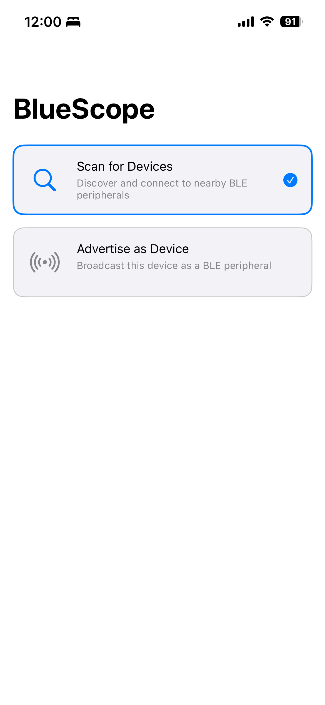
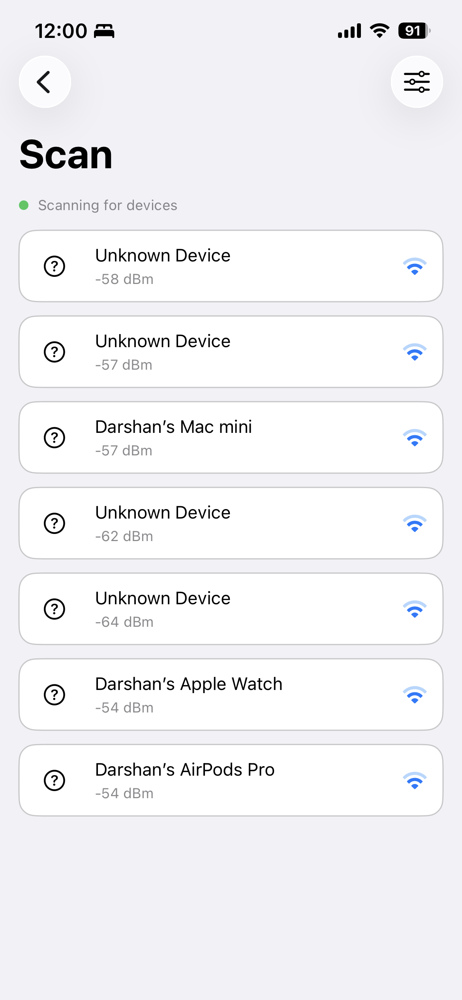
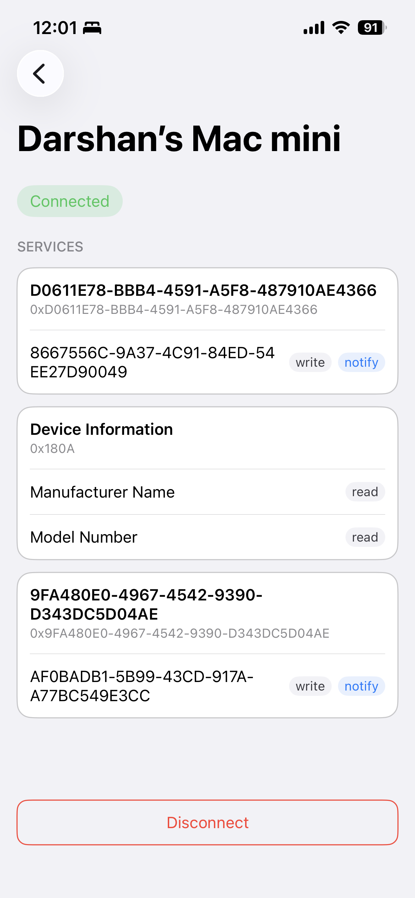
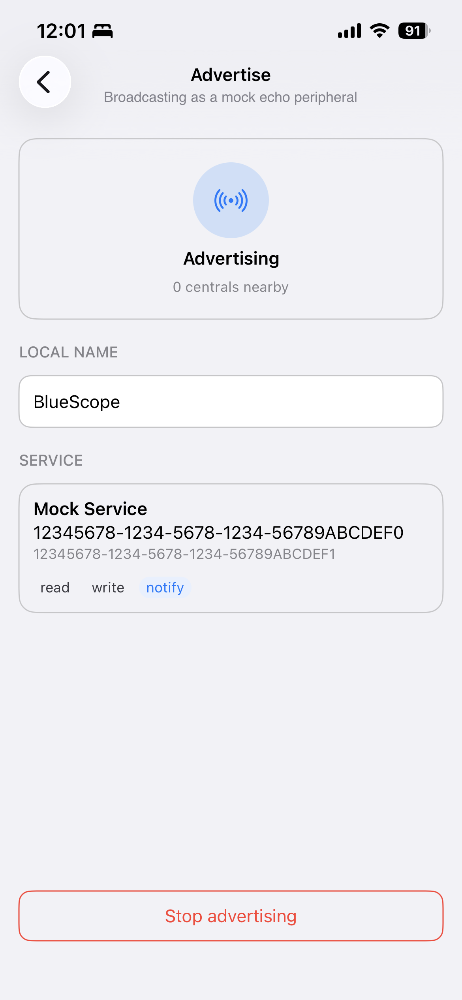
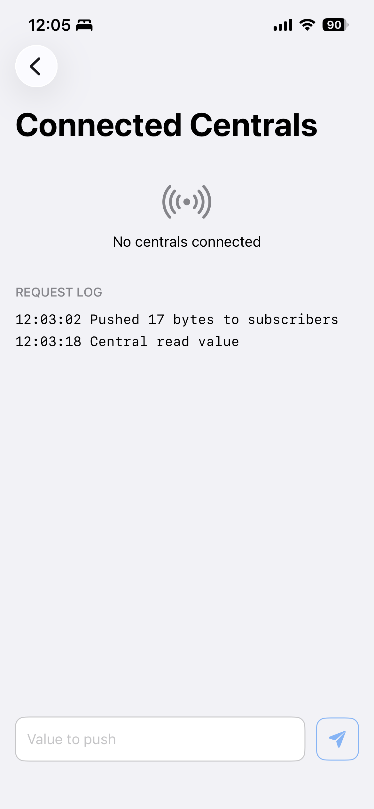

# BlueScope — BLE Central & Peripheral iOS Demo

An iOS demo app built with **Core Bluetooth** that showcases both sides of a Bluetooth Low Energy connection in a single app. Switch between **Central** and **Peripheral** modes, run it on two iPhones, and watch them discover, connect, and exchange data — with a live log tracking every action along the way.

## Overview
 
The app has two flows:
 
- **Central mode** — scan for nearby BLE devices, connect, explore their services and characteristics, and interact with them via read, write, and notify.
- **Peripheral mode** — advertise a service, accept connections from one or more centrals, and read, write, and push notification updates to all connected centrals.
Every BLE action and state change is captured in an in-app **log**, so you can follow exactly what's happening under the hood — scans, connections, reads/writes, subscription changes, and Bluetooth status updates.

## Features
 
### Central Mode
- Discover nearby BLE peripherals
- Connect / disconnect to a selected device
- List all services and characteristics of the connected peripheral
- **Read** characteristic values
- **Write** values to writable characteristics
- **Subscribe (notify)** to characteristics and receive live value updates
### Peripheral Mode
- Advertise a custom service so centrals can find the device
- Accept connections from multiple centrals simultaneously
- Respond to **read** and **write** requests from connected centrals
- **Notify** updated values to all subscribed centrals at once

## Apps Objective and Goal

CoreBluetooth's delegate-based API is one of the harder Apple frameworks to wrap cleanly: it's callback-heavy, stateful, and easy to leak into every layer of an app if you're not disciplined about it. BlueScope is a deliberate exercise in **not** doing that — every CoreBluetooth type is translated into a plain Swift domain type at a single boundary, and everything above that boundary (view models, views, tests) only ever sees protocols and value types.

It demonstrates:

- A **translation-boundary architecture** that keeps a third-party/system framework from bleeding into application code.
- **State modeled as enums with associated values**, not booleans — a connection is `connecting`, `discoveringServices`, `connected(services:)`, or `failed(BLEError)`, never a loose `isConnected` flag that can silently drift from reality.
- **Protocol-oriented dependency injection** end to end — every view model is constructed with an interface, never a concrete CoreBluetooth-backed class, which makes the entire object graph unit-testable without a real radio, a simulator, or a physical device.
- Idiomatic use of **Combine for continuous streams** (scan results, connection state, advertising state) alongside **async/await for one-shot operations** (connect, read, write) — bridged out of CoreBluetooth's delegate callbacks with `CheckedContinuation`.

## How It Works

BlueScope has two independent modes, switched at launch and never active simultaneously (`RoleManager` owns the swap and tears down whichever role is being vacated):

### Central mode — scan, connect, inspect
- Scans for nearby BLE peripherals with a live, RSSI-sorted list and signal-strength iconography
- Filters by a coarse device-kind heuristic (heart-rate monitors, generic dev boards) inferred from advertised names
- Connects to a peripheral, discovers its GATT services and characteristics, and renders them as cards
- Reads, writes, and subscribes to notifications on individual characteristics
- Displays live characteristic values in **decimal, hex, or ASCII**, switchable on the fly
- Keeps scanning/connections alive in the background via `CBCentralManager` state preservation and restoration, and automatically reconnects if a connection drops
- Restores the last-connected peripheral across an app relaunch and navigates straight to its Device Detail screen once the reconnection completes

### Peripheral mode — advertise, respond, observe
- Advertises a mock "Echo Service" (`FE01`), UUID shown in the UI, with a read/write/notify characteristic, using `CBPeripheralManager`
- Lets you rename the advertised local name at runtime — the name **persists across launches** via `UserDefaults`, restarting advertising live if it's currently broadcasting
- Lists connected centrals and whether each has subscribed for notifications
- Streams a live request log of every read/write/subscribe event a connected central triggers
- Lets you push an arbitrary value out to subscribed centrals on demand

## Architecture

Strict, one-directional layering — nothing downstream of `BluetoothKit` is allowed to name a CoreBluetooth type:

```
┌─────────────────────┐       ┌─────────────────────┐       ┌─────────────────────┐       ┌─────────────────────┐
│    CoreBluetooth    │       │    BluetoothKit     │       │     ViewModels      │       │        Views        │
│  CBCentralManager   │  ──▶  │    (translation     │  ──▶  │     @MainActor      │  ──▶  │      SwiftUI,       │
│ CBPeripheralManager │       │      boundary)      │       │  ObservableObject   │       │      no logic       │
└─────────────────────┘       └─────────────────────┘       └─────────────────────┘       └─────────────────────┘
```

**`BluetoothKit/`** is the only place `CBPeripheral`, `CBCharacteristic`, `CBCentral`, and `CBATTRequest` are allowed to exist. (`CBUUID` is the sole exception — it's a plain identifier value type, safe to use as domain currency everywhere.) Everything a view model can depend on is a protocol defined here:

| Protocol | Real implementation | Test double |
|---|---|---|
| `CentralManaging` | `CentralManager` (wraps `CBCentralManager`) | `MockCentralManager` |
| `PeripheralManaging` | `PeripheralManager` (wraps `CBPeripheralManager`) | `MockPeripheralManager` |

Every view model takes its manager as an injected protocol-typed dependency — never constructs the concrete class itself. `RoleManager` is the single place that ever calls `CentralManager()` / `PeripheralManager()`.

`RoleManager` also persists the last active role via a small `RolePersisting` protocol (`UserDefaultsRolePersisting`) and restores it automatically on launch — the same protocol-backed persistence pattern used for the peripheral's advertised local name.

### State machines, not booleans

`ConnectionState` is the model for this pattern, used consistently across the app:

```swift
enum ConnectionState: Equatable {
    case disconnected
    case connecting
    case discoveringServices
    case connected(services: [DiscoveredService])
    case failed(BLEError)
}
```

A "connected but with no services yet" state, or a `Bool isConnected` that's stale mid-handshake, is structurally impossible to represent — the type system does the work a code reviewer would otherwise have to.

### Error handling

Every CoreBluetooth failure mode is translated into a named `BLEError` case with a `localizedDescription` written for a user, not a stack trace:

```swift
case .connectionTimeout            → "Connection timed out."
case .bluetoothUnavailable(.poweredOff) → "Turn on Bluetooth to continue."
```
instead of surfacing `"Operation could not be completed. (CBATTErrorDomain error 14.)"` directly.

## Project structure

```
BlueScope/
├── App/                     RoleManager (owns which role is active + its manager's lifecycle), AppRole
├── BluetoothKit/            The translation boundary
│   ├── Central/               CentralManaging, CentralManager, ConnectionState, DiscoveredPeripheral, DiscoveredService
│   ├── Peripheral/             PeripheralManaging, PeripheralManager, ConnectedCentral, MockGATTService
│   └── Shared/                 BluetoothState, BLEError, CharacteristicValue, CBUUID+FriendlyName
├── Features/                One folder per screen: View + ViewModel (+ local-only subviews)
│   ├── RoleSelection/
│   ├── CentralMode/            Scan, DeviceDetail, CharacteristicDetail
│   └── PeripheralMode/         Advertise, ConnectedCentrals
├── Common/
│   ├── Theme/                  AppFont — typography tokens
│   └── Components/             OutlinedButton, ConnectionStatusBadge, PropertyBadge, EmptyStateView
└── Resources/                Assets.xcassets (all color tokens live here — no hardcoded hex anywhere in the app)
```

Testability is designed in, not bolted on:

```
BlueScopeTests/
├── BluetoothKit/Testing/     MockCentralManager, MockPeripheralManager
├── MockLocalNameStore
└── <Feature>ViewModelTests.swift   — one per view model, driving the mock directly
```

## Tech stack

| Layer | Choice |
|---|---|
| UI | SwiftUI — no UIKit, no Storyboards |
| Reactive state | Combine (`CurrentValueSubject`, `AnyPublisher`) for continuous streams |
| Concurrency | Swift Concurrency (`async/await`, `@MainActor`, `CheckedContinuation`) for one-shot operations |
| Hardware | CoreBluetooth (`CBCentralManager`, `CBPeripheralManager`) — no third-party BLE libraries |
| Architecture | MVVM + protocol-oriented dependency injection |
| Persistence | `UserDefaults`, behind small `LocalNamePersisting` (advertised name) and `RolePersisting` (last active role) protocols — never touched directly by a view model |
| Testing | XCTest + Swift Testing, unit tests only, entirely mock-driven |
| Design system | SF Symbols only; every color and font resolves through `Common/Theme/` or the Asset Catalog — nothing hardcoded |

## Testing

35 unit tests across every view model and the role-switching logic, all driven through `MockCentralManager` / `MockPeripheralManager` / `MockLocalNameStore` — none of them touch a real radio, a simulator's Bluetooth stack, or a physical device:

```swift
func test_connect_whenManagerThrowsTimeout_surfacesUserFacingMessage() {
    let mock = MockCentralManager()
    mock.connectError = .connectionTimeout
    let viewModel = DeviceDetailViewModel(peripheral: somePeripheral, centralManager: mock)

    await viewModel.connect()

    XCTAssertEqual(viewModel.connectionState, .failed(.connectionTimeout))
}
```

Typed error paths are tested explicitly, not just the happy path — the goal is that a broken CoreBluetooth callback should fail a fast, in-memory unit test long before it fails on-device.

## Getting started

**Requirements**
- Xcode 26 or later
- iOS 26.5+ deployment target (simulator or device — peripheral-mode advertising and central-mode scanning both work in Simulator using loopback, but a real two-device test needs physical hardware)

**Build & run**
```bash
git clone git@github.com:rajdarshan/BLE-Central-Peripheral-iOS-Demo.git
cd BLE-Central-Peripheral-iOS-Demo
open BlueScope.xcodeproj
```
Select the `BlueScope` scheme and run. To verify a clean build from the command line:
```bash
xcodebuild -project BlueScope.xcodeproj -scheme BlueScope -configuration Debug clean build
```

**Try it end to end:** run the app on two devices (or one device + one simulator) — put one in **Advertise** mode and the other in **Scan** mode, connect, and read/write/subscribe to the mock Echo characteristic to watch both sides of the exchange update live, including the peripheral's request log. Kill and relaunch the app on the central side: it restores the last active role automatically, and if the previously connected peripheral is still in range it reconnects and drops you straight back into its Device Detail screen.

## Demo

<!--
Drop screen-recording GIFs into docs/gifs/ and reference them here, e.g.:

| Central mode | Peripheral mode |
|---|---|
|  |  |
-->
_Central mode GIF coming soon._
_Peripheral mode GIF coming soon._

## Screenshots

<!--
Drop screenshots into docs/screenshots/ and reference them here, e.g.:

| Role Selection | Scan | Device Detail |
|---|---|---|
|  |  |  |

| Advertise | Connected Centrals |
|---|---|
|  |  |
-->
_Screenshots coming soon._

## Troubleshooting
 
- **Peripheral not discovered** — confirm Bluetooth is on for both devices, the peripheral is actively advertising, and both apps are in the foreground (background BLE needs extra capabilities).
- **Stale services/characteristics** — iOS caches GATT data; toggle Bluetooth off/on to clear it.
- **Simulator issues** — Core Bluetooth is unsupported on the Simulator; always use real hardware.

## License
 
This project is available for learning and demo purposes. Add a license file (e.g., MIT) if you plan to open it up for reuse.
